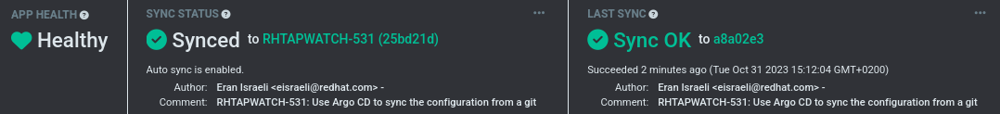

# Development/testing environment for RHTAP Logging

## Prerequisites

1. A [Quickcluster](https://resourcehub.redhat.com/resources/quickcluster/clusters)
cluster.

1. Use [setup-nfs-quickcluster.sh](
   https://github.com/redhat-appstudio/infra-deployments/blob/main/hack/quickcluster/setup-nfs-quickcluster.sh) 
   to setup NFS.

## Argo CD Deployment
1. Install the OpenShift GitOps Operator
```console
oc create -f install-openshift-gitops-operator.yaml
```
Once the the operator installation is complete, the link to Argo CD will be visible from
the OpenShift Console.

Argo CD should be also accessible through this link:
https://openshift-gitops-server-openshift-gitops.apps.[cluster_host]

Example for cluster_host: 'mycluster.lab.psi.pnq2.redhat.com'.\
You can get the information from the Quickcluster cluster page.

1. Create the Argo CD logging app
```console
oc create -f argocd-app.yaml
```
After a successful deployment, the sync indicator should indicate `Synced` and the
overall health status of the app should be `Healthy`.


1. Apply the logging health checks
```console
oc apply -f health-checks.yaml -n openshift-gitops
```
For example, `clusterlogforwarder` before applying the Argo CD health check:


`clusterlogforwarder` after applying the Argo CD health check:


## Checking the logs
1. Open Splunk in your browser with the following command:
```console
xdg-open "$(oc get route splunk-web --template='{{.spec.host}}' --namespace=splunk)"
```
2. Login with u:admin/p:Password.
3. Run a Splunk query against the index `rh_rhtap_dev_audit` or `rh_rhtap_dev_app`.\
E.g: `index="rh_rhtap_dev_audit"`

## Diagnostics
Relevant pod logs can be found in the following namespaces:
| Namespace                  | Description 	                                           |
|---                         |---	                                                   |
| openshift-operators        | openshift-gitops-operator, external-secrets-operator    |
| external-secrets           | External Secrets resources                              |
| splunk                     | Splunk resources                                        |

## Links
1. [Splunk dev image on Quay.io](https://quay.io/repository/rhtap-o11y-dev/splunk-infra-dev?tab=tags&tag=splunk-dev-bundle)

## Documentation Links
### OpenShift Logging
1. [OpenShift Logging](https://docs.openshift.com/container-platform/4.13/logging/cluster-logging.html)
1. [Deploy OpenShift Logging via CLI](https://docs.openshift.com/container-platform/4.13/logging/cluster-logging-deploying.html#cluster-logging-deploy-cli_cluster-logging-deploying)

### External Secrets Operator
1. [external-secrets.io](https://external-secrets.io)
1. [Installing External Secrets Operator with OLM](https://external-secrets.io/latest/introduction/getting-started/#installing-with-olm)

### Argo CD
1. [Argo CD Operator](https://argocd-operator.readthedocs.io)
1. [Argo CD](https://argo-cd.readthedocs.io)

### Red Hat's GitOps Operator
1. [Red Hat OpenShift GitOps](https://docs.openshift.com/gitops)
1. [Installing GitOps Operator](https://docs.openshift.com/container-platform/4.13/cicd/gitops/installing-openshift-gitops.html#installing-gitops-operator-using-cli_installing-openshift-gitops)

### Known Issues
1. `external-secrets` operatorconfig fails to sync with the following error:
```
The Kubernetes API could not find operator.external-secrets.io/OperatorConfig for
requested resource external-secrets/cluster. Make sure the "OperatorConfig" CRD is
installed on the destination cluster.
```

How to resolve:
1. Terminate the current sync attempt.
1. sync the `external-secrets` namespace.
1. sync the `external-secrets-operator`
1. Everything else should sync successfully.